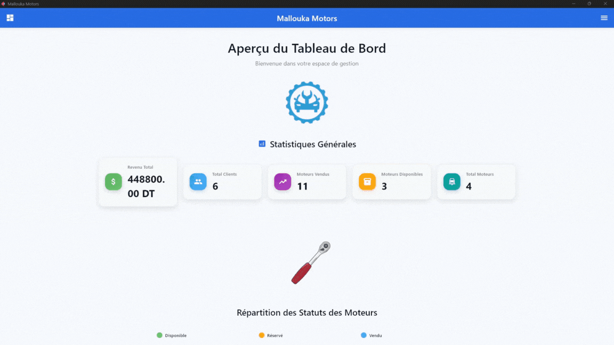

<div align="center">

# 🚗 Mallouka Motors

### *Professional Motor Management System*




[](https://flet.dev/docs/getting-started)
[](https://sqlite.org)
[](https://python.org)
[](LICENSE)

---

</div>

## 📋 About the Project

**Mallouka Motors** is a comprehensive, user-friendly desktop and mobile application engineered to revolutionize motor dealership operations. Built with modern Python technologies and the powerful Flet framework, this solution delivers seamless management of inventory, clients, billing, and business analytics.

> 🎯 **Mission**: Streamline automotive business operations through intelligent automation and intuitive design.

This project represents a successful freelance collaboration between **Karim Feki** and **Mallouka Motors**, delivering exceptional value and operational efficiency that has exceeded client expectations.

---

## 🎬 Application Demo

<div align="center">

### 🌙 Dark Mode Interface


### ☀️ Light Mode Interface


</div>

## ✨ Key Features

<div align="center">

| Feature | Description | Status |
|---------|-------------|--------|
| 📊 **Analytics Dashboard** | Real-time KPIs, revenue tracking, and business insights | ✅ Complete |
| 💰 **Smart Billing System** | Automated invoice generation with PDF export | ✅ Complete |
| 🚗 **Motor Inventory** | Complete CRUD operations for motor management | ✅ Complete |
| 👥 **Client Management** | Comprehensive customer relationship management | ✅ Complete |
| 🎨 **Theme Customization** | Light/Dark mode with modern UI/UX | ✅ Complete |

</div>

### 📊 Dashboard & Analytics
- **Real-time Metrics**: Total revenue, client count, motors sold, and inventory status
- **Interactive Charts**: Visual representation of sales trends and inventory distribution
- **Performance Indicators**: Key business metrics at a glance
- **Data Visualization**: Modern charts and graphs for better insights

### 💰 Billing Management
- **📄 Invoice Generation**: Professional PDF invoices with company branding
- **🔄 Multi-Motor Billing**: Support for multiple motors per invoice
- **💳 Payment Tracking**: Monitor payment status and methods
- **📋 Billing History**: Complete transaction records with search functionality

### 🚗 Motors Management
- **➕ Add New Motors**: Comprehensive motor registration with all specifications
- **✏️ Edit & Update**: Real-time inventory updates with validation
- **🔍 Advanced Search**: Filter by brand, model, year, status, and price range
- **📈 Status Tracking**: Available, sold, reserved status management
- **💾 Data Integrity**: Robust validation and error handling

### 👥 Clients Management
- **📝 Client Registration**: Complete customer profile management
- **📞 Contact Management**: Phone numbers, addresses, and tax information
- **🔄 Real-time Updates**: Instant synchronization across all modules
- **🔍 Quick Search**: Fast client lookup and filtering capabilities

### ⚙️ Settings & Customization
- **🎨 Theme Switcher**: Seamless light/dark mode transitions
- **ℹ️ About Section**: Company information and application details
- **🔧 Configuration**: Customizable application settings

---

## 🛠️ Technology Stack

<div align="center">

### Core Technologies
[](https://python.org)
[](https://flet.dev)
[](https://sqlite.org)

### Key Libraries & Tools
[](https://reportlab.com)
[](https://sqlite-utils.datasette.io)
[](https://pypi.org/project/python-dotenv)

</div>

### 🏗️ Architecture Overview

```
📁 Mallouka Motors
├── 🎯 Frontend (Flet Framework)
│   ├── 📊 Dashboard Module
│   ├── 🚗 Motors Management
│   ├── 👥 Clients Management
│   ├── 💰 Billing System
│   └── ⚙️ Settings & Themes
├── 🗄️ Backend (Python + SQLite)
│   ├── 📋 Database Models
│   ├── 🔄 CRUD Operations
│   └── 📄 PDF Generation
└── 🎨 Assets & Resources
    ├── 🖼️ Demo Images/GIFs
    ├── 🎨 Icons & Logos
    └── 📝 Documentation
```

### 💡 Technical Highlights

- **🚀 Cross-Platform**: Desktop and mobile compatibility through Flet framework
- **⚡ Real-time Updates**: Instant data synchronization across all modules
- **🔒 Data Integrity**: Robust validation and error handling mechanisms
- **🎨 Modern UI/UX**: Material Design principles with custom theming
- **📱 Responsive Design**: Adaptive layouts for different screen sizes
- **🔄 Efficient Database**: Optimized SQLite queries with proper indexing

---

## 🚀 Getting Started

### 📋 Prerequisites

- **Python 3.8+** installed on your system
- **Git** for version control
- **Virtual environment** (recommended)

### ⚡ Quick Installation

```bash
# Clone the repository
git clone https://github.com/fekikarim/Mallouka_Motors.git
cd Mallouka_Motors

# Create virtual environment
python -m venv venv

# Activate virtual environment
# Windows:
venv\Scripts\activate
# macOS/Linux:
source venv/bin/activate

# Install dependencies
pip install -r requirements.txt

# Run the application
python src/main.py
```

### 🔧 Development Setup

```bash
# Install development dependencies
pip install -e .

# Initialize database (if needed)
python src/db.py

# Run in development mode
flet run src/main.py
```

---

## 🤝 Contributing

<div align="center">

**We welcome contributions from the community!** 🎉

[](CONTRIBUTING.md)
[](https://github.com/fekikarim/Mallouka_Motors/issues)
[](https://github.com/fekikarim/Mallouka_Motors/pulls)

</div>

### 🛠️ How to Contribute

1. **🍴 Fork** the repository
2. **🌿 Create** a feature branch (`git checkout -b feature/AmazingFeature`)
3. **💻 Commit** your changes (`git commit -m 'Add some AmazingFeature'`)
4. **📤 Push** to the branch (`git push origin feature/AmazingFeature`)
5. **🔄 Open** a Pull Request

### 🐛 Bug Reports & Feature Requests

- **🐛 Found a bug?** [Open an issue](https://github.com/fekikarim/Mallouka_Motors/issues/new?template=bug_report.md)
- **💡 Have an idea?** [Request a feature](https://github.com/fekikarim/Mallouka_Motors/issues/new?template=feature_request.md)

### 📝 Development Guidelines

- Follow **PEP 8** coding standards
- Write **clear commit messages**
- Add **tests** for new features
- Update **documentation** as needed

---

## 🏆 Acknowledgments

<div align="center">

### 🤝 Special Thanks

**Mallouka Motors** - For trusting us with their digital transformation journey and providing the opportunity to create this comprehensive business solution.

### 👨‍💻 Development Team

**Karim Feki** - Lead Developer & Project Architect
- 🎯 Full-stack development
- 🎨 UI/UX design
- 📊 Database architecture
- 🔧 System optimization

</div>

---

## 📄 License

<div align="center">

This project is licensed under the **MIT License** - see the [LICENSE](LICENSE) file for details.

[](https://opensource.org/licenses/MIT)

</div>

---

## 📞 Contact & Support

<div align="center">

### 🤝 Let's Connect!

[](mailto:feki.karim@outlook.com)
[](https://www.linkedin.com/in/karimfeki/)
[](https://github.com/fekikarim)

### 💼 Professional Services

- **🚀 Custom Software Development**
- **📱 Cross-Platform Applications**
- **🎨 UI/UX Design**
- **🔧 System Integration**
- **📊 Business Analytics Solutions**

---

<div align="center">

**⭐ If you found this project helpful, please consider giving it a star!**

[](https://github.com/fekikarim/Mallouka_Motors/stargazers)
[](https://github.com/fekikarim/Mallouka_Motors/network/members)

</div>

</div>

---

<div align="center">

**Made with ❤️ by [Karim Feki](https://github.com/fekikarim)**

*Transforming business operations through innovative technology solutions*

</div>